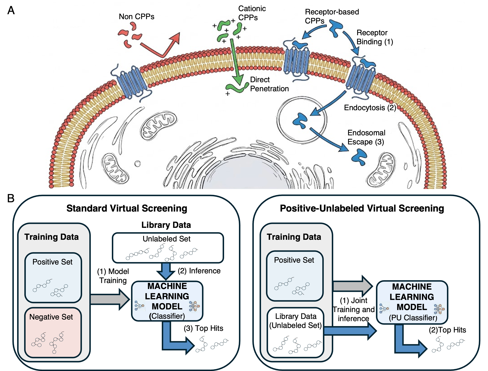

<h1 align="center">BaggingCPP</h1>
<h3 align="center">A Deep Positive-Unlabeled Learning Approach to Cell Penetrating Peptide Discovery</h3>

Cell-penetrating peptides (CPPs) are a promising approach for the intracellular delivery of diverse molecular cargos. However, although hundreds of CPPs have been characterized, most are cationic peptides with poor pharmacoproperties or limited uptake efficiency; new high-throughput discovery approaches are thus imperative. Here, we introduce BaggingCPP, a deep learning-based CPP virtual screening framework that integrates protein language models, Positive-Unlabeled (PU) learning and parameter-efficient fine-tuning algorithms. Unlike prior works, we do not use an artificial negative set on which to train the model. Instead, we use PU learning to directly train and infer on the candidate library  - a large collection of naturally expressed peptides such as hormones, neuropeptides, and small proteins. We show that BaggingCPP is competitive with the state-of-the-art model GraphCPP when training and evaluating on the standard public CPP1708 benchmark. More importantly, we demonstrate that the PU learning formulation effectively addresses the distribution shift and prediction stability problems commonly encountered in the standard train-then-screen protocol, thereby significantly reducing the false positive rate. Using BaggingCPP, we identified and experimentally validated several CPPs with low similarity to known CPPs, including two with higher uptake efficiency than the gold-standard TAT peptide. The latter are cyclic peptides that may penetrate via GPCR-mediated endocytosis - a relatively rare mechanism of entry. BaggingCPP thus represents a data-driven approach to expand the chemical diversity of CPPs.

# Installation

## Python Environment Setup
A conda distribution is required. To create the conda and python environment, run:  
<code>bash scripts/env/create_conda_env.sh </code>

To activate the environment, run:   <code>activate BaggingCPP </code>

## Downloading model weights from HuggingFace

In order to download the models ensemble run:
Jerome the huggingface model and data is still private,so use: 
<code>/home/iscb/wolfson/omriyakir/BaggingCPP/huggingface/download_test.py</code> for testing, I'll make everything public when we will publish.  

# Model Inference

Run inference using the model from huggingface: 
<code>python -m inference.inference \
    --sequences_fasta example/example.fasta  \
    --output_csv example/example_output.csv
</code>

Note that, by construction, if a test sequence appears in the unlabeled training set, it was used as a **negative** for some of the models, leading to underestimation of its CPP probability. To correct for this bias, by default, the script checks, for each sequence, whether it appears in the training set and, if yes, in which fold. It then only uses one of the model ensembles that was not trained on this sequence to make prediction. For sequences that are not part of the training set, it averages the results of the 5 ensembles (250 models in total).

 
If you want to average the results of the 5 ensembles (no cross predictions) for all sequences, use:
<code>python -m inference.inference \
    --sequences_fasta example/example.fasta  \
    --output_csv example/example_output.csv \
    --no_cross_predictions</code>

# Data Preparation and Training From Scratch

This is the code for retraining from scratch the original model. It can be easily adapted to any other PU learning classification task over peptides.

The raw data should be provided as a .csv file (see: datasets/full_datasets/bagging_cpp_dataset.csv), with the following columns: 
- id: unique ID per sequence [e.g.: Seq1, ... ]
- sequence: amino acid sequence [e.g.: ACDEFG]
- source: optional source database [e.g.: SmProt2, NeuroPep]
- description: optional sequence description [e.g.:  ]
- label: 0/1 (1 for positive instances, 0 for unlabeled)

In bagging_cpp_dataset.csv, we also provide the fold_id used in the article, but these columns are generated in the next steps.

## Data Preparation

<ol start="1">
<li>
Cluster sequences and divide the dataset into 5 folds:  
<code>python -m data_preparation.cross_validation</code></li>
<li>
Sample and save unlabeled sequences for the different submodels:  
For the inductive setting:  
<code>python -m data_preparation.ensemble_dataset_creator --algorithm_name inductive_pu_learning</code> 
For the transductive setting: 
<code>python -m data_preparation.ensemble_dataset_creator --algorithm_name transductive_pu_learning</code> </li>
</ol>

## Run Training
<ol start="1">
<li>
For each of the configurations under <code>configurations/data/{ensemble_inductive_pu_learning or ensemble_transductive_pu_learning}</code>, run:  
<code> python -m models.train --config {path_to_configuration}
</code> 
e.g. <code> python -m models.train --config configurations/data/ensemble_inductive_pu_learning/groups_inductive_index_0.json
</code> </li>
</ol>

To regenerate configuration files with different hyperparameters, see the notebooks in configurations/build/ .

## Generate prediction tables in the transductive setting:
After training the ensemble, run: 
<code> evaluation/aggregate_transductive_payload.py </code>.
The prediction table is saved in the results folder of the ensemble_transductive_pu_learning hypothesis, in: 
<code>results/hypothesis/ensemble_transductive_pu_learning/groups_transductive/aggregated_payload/predictions.csv</code>

## Evaluation
For AUC-ROC calculation(only valid for the inductive setting),run the notebook: 
 <code> evaluation/evaluation_ensemble.ipynb</code>:

## Run inference over the inductive pu learning trained ensemble:
In order to run inference using the trained model do:  
<code>python -m inference.inference \
    --sequences_fasta example/example.fasta \
    --output_csv inference/predictions.csv \
    --use_custom_model
</code>
If you want to average the results of the 5 ensembles (no cross predictions) use:
<code>python -m inference.inference \
    --sequences_fasta example/example.fasta \
    --output_csv inference/predictions.csv \
    --use_custom_model \
    --no_cross_predictions
</code>
